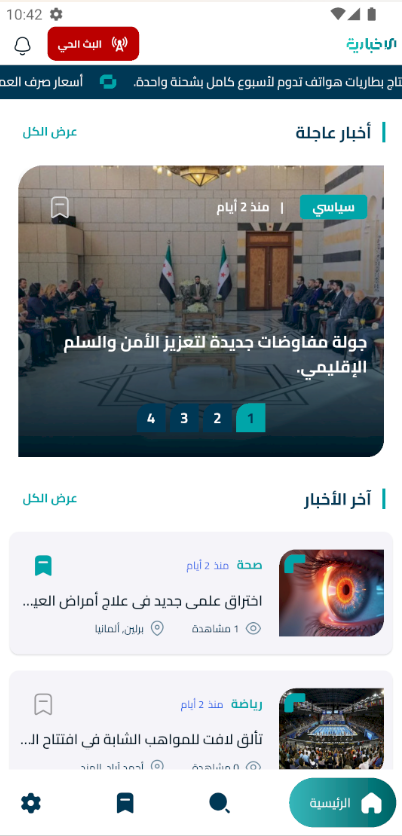
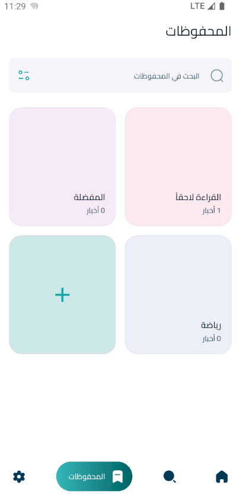
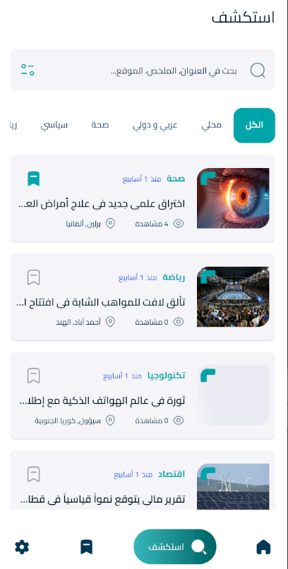
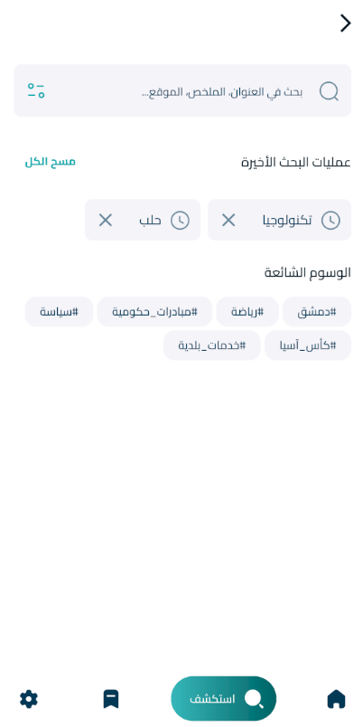
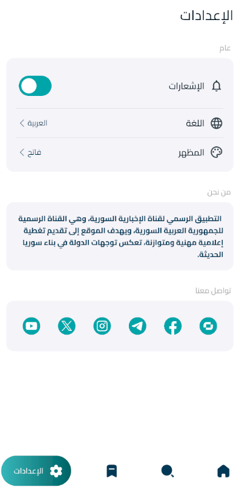

<div align="center">

# Al‑Ikhbariah — الإخبارية

**A bilingual (AR/EN) news platform built with Flutter, backed by Supabase (Postgres + Realtime) and Firebase Cloud Messaging.**

[](https://docs.flutter.dev)
[](https://dart.dev)
[](https://supabase.com)
[](https://riverpod.dev)
[](#9--contributing--license)

</div>

---

## Table of Contents

1. [Overview](#1--overview)
2. [Key Features](#2--key-features)
3. [Tech Stack & Architecture](#3--tech-stack--architecture)
4. [Folder Structure](#4--folder-structure)
5. [Getting Started](#5--getting-started)
6. [Configuration & Environment Variables](#6--configuration--environment-variables)
7. [Usage & Screenshots](#7--usage--screenshots)
8. [Testing, Code Generation & Scripts](#8--testing-code-generation--scripts)
9. [Contributing & License](#9--contributing--license)

---

## 1. Overview

**Al‑Ikhbariah** is the official mobile application of the Syrian *Al‑Ikhbariah* news channel. It delivers breaking news, featured stories, most‑read articles, video programs, live streams, and push notifications — fully localized in **Arabic** (default, RTL) and **English**.

> **Purpose** — Deliver real-time, professionally curated news coverage to a mobile audience with offline-capable bookmarking and instant push notifications.

The application is a **client-only** repository. All content, authentication, storage, and realtime subscriptions are served by a **Supabase** backend (schema, RLS policies, SQL functions, and triggers are versioned under [`supabase/`](supabase)), while **Firebase Cloud Messaging** powers push delivery through a Supabase Edge Function.

| | |
|---|---|
| **Package name** | `alikhbariah` |
| **Bundle ID (Android)** | `com.example.alikhbariah` |
| **Default locale** | `ar` (with `en` fallback) |
| **Version** | `0.1.0` |
| **License** | Proprietary — all rights reserved |

---

## 2. Key Features

### 📰 News & Content
- **Breaking News ticker** — horizontally paged, indicator‑driven carousel backed by a Supabase **realtime** stream (`breaking_news` table).
- **Featured / Most‑Read sections** — ranked by `is_featured` flag and `views_count` respectively.
- **Latest Posts feed** — ordered by `published_at` with category and time‑range filtering.
- **Post details** — full article view, tags, view counter (`increment_post_views` RPC), and **related posts** resolved via the `get_related_posts` SQL function.
- **Live Stream** — one‑tap jump to the active YouTube broadcast surfaced from the app bar.
- **Video hub** — category browsing (`news_video`, `program`), in‑category search, and an embedded YouTube player with HD forced playback and fullscreen support.

### 🔍 Explore & Discovery
- **Full‑text search** across `title`, `summary`, `content`, and `location` using Postgres `ilike` OR‑filters.
- **Composite filters** — category, time range (today / this week / all time), urgent, and featured, applied through a reusable filter dialog.
- **Popular tags** — powered by the `get_popular_tags` RPC, with tag → post drill‑down.
- **Recent searches** — persisted locally.

### 🔖 Bookmarks (Offline)
- **Collections** — create, rename, and delete named collections; two default collections (*Read Later*, *Favorite*) are seeded on first launch.
- **Offline article storage** — saved posts and their images are persisted in **ObjectBox** (via `Dio` image download into app documents), so bookmarked content is readable with no network.
- **Offline post details** — a dedicated reader rendering the locally cached copy.

### 🔔 Notifications
- **Push notifications** via Firebase Cloud Messaging + Awesome Notifications (rich big‑picture layout, custom `basic_channel`).
- **Device token registration** — FCM tokens upserted into the `devices` table on init and on token refresh.
- **In‑app notification inbox** — persisted in the `notifications` table and read through the app.
- **User opt‑out** — a settings toggle persisted in `SharedPreferences` and respected in both foreground and background handlers.
- **Deep‑link handling** — tapping a notification routes to the related post.

### 🎨 Experience & UX
- **Onboarding flow** — shown only on first launch (guarded by a `redirect` in the router + `SharedPreferences`).
- **Material 3 theming** — full **light / dark / system** support with a persisted `ThemeNotifier`.
- **Bilingual RTL‑ready UI** — `easy_localization` with `ar` / `en`, automatic layout direction, and generated `LocaleKeys` constants.
- **Skeleton loaders** (`skeletonizer`) and Lottie empty/error animations for polished loading states.
- **Bottom navigation shell** — 4 indexed branches (Home, Explore, Bookmark, Settings) using `StatefulShellRoute.indexedStack` to preserve per‑tab state.
- **Custom design system** — centralized colors, gradients, shadows, text styles, icon font, and responsive spacing/padding scales.

---

## 3. Tech Stack & Architecture

### Frontend
| Concern | Choice |
|---|---|
| Framework | **Flutter 3.41+** (stable) / **Dart 3.10+** (`sdk: ^3.10.8`) |
| State Management | **Riverpod 2.6** — `Provider`, `FutureProvider`, `AsyncNotifierProvider` |
| Navigation | **go_router 17** — declarative routes, `StatefulShellRoute.indexedStack`, `redirect` guards |
| Dependency Injection | **get_it 9** — `GetIt` service locator, lazy singletons |
| Forms | **reactive_forms 18** + `reactive_dropdown_search` |
| Localization | **easy_localization 3** + generated `LocaleKeys` |
| Codegen | **freezed 3** + **json_serializable 6** (`build_runner`) |
| HTTP / Media | **dio 5**, `youtube_player_flutter 9`, `flutter_svg`, `lottie 3`, `url_launcher` |
| Local Persistence | **ObjectBox 5** (documents) + **shared_preferences 2** (flags/preferences) |
| Platform Support | Android, iOS, Web, Windows, macOS, Linux |

### Backend / Services
| Concern | Choice |
|---|---|
| Database | **Supabase (PostgreSQL 17)** — schema, RLS policies, indexes, and functions live in [`supabase/db`](supabase/db) |
| Realtime | Supabase **Realtime** channels (`.stream(primaryKey: ['id'])`) for breaking news & post lists |
| Storage | Supabase **Storage** — public `news-media` bucket for post/category media |
| Push | **Firebase Cloud Messaging** via a Supabase **Edge Function** (`send-push`, Deno + `firebase-admin`) |
| Auth | Supabase **Auth** — admin verification via `app_users.is_admin` and the `is_admin()` helper function |

### Architecture

The codebase follows a **feature‑first Clean Architecture** (`Data → Domain ← Presentation`) with a shared `core` layer.

**Key patterns in use**

- **Clean Architecture per feature** — every feature folder under `lib/features/` is split into `data/`, `domain/`, and `presentation/`, so remote (Supabase) and local (ObjectBox) sources are interchangeable.
- **Repository + UseCase pattern** — data sources implement abstract contracts; repositories translate transport errors into typed `Failure` objects; `UseCase<T, Param>` (`core/usecases`) encapsulates a single business action (`call()`).
- **Constructor injection via get_it** — `injection_container.dart` wires data sources → repositories → use cases as lazy singletons, resolved at call time with `sl<T>()`.
- **Riverpod for state, get_it for dependencies** — providers are thin adapters that bridge DI‑resolved use cases into the widget tree.
- **Reactive data** — data sources return `Stream<List<Model>>` where realtime updates matter, and `Future<List<Model>>` for one‑shot queries; providers map them into `AsyncValue` for the UI.
- **Declarative routing** — all paths live in `app_route_config.dart`; page transitions are pure data.
- **Error handling** — `ErrorHandlingManager` maps `Exception` → localized message via `errors.*` translation keys, surfaced through dialogs and snack bars.

---

## 4. Folder Structure

```
alikhbariah/
├── lib/
│   ├── main.dart                     # App entry: DI init → EasyLocalization → ProviderScope → MaterialApp.router
│   ├── injection_container.dart      # get_it registrations (services → repositories → use cases, per feature)
│   ├── firebase_options.dart         # FlutterFire generated config (android + web)
│   │
│   ├── config/                       # App-wide configuration
│   │   ├── constant/
│   │   │   ├── app_env.dart          # flutter_dotenv loader → SUPABASE_URL / SUPABASE_ANNON_KEY
│   │   │   └── assets_path.dart      # Typed asset path constants
│   │   ├── router/
│   │   │   ├── app_route_config.dart # Central route name/path registry
│   │   │   └── app_router.dart       # GoRouter graph + auth/onboarding redirect guard
│   │   ├── scales/                   # Responsive spacing, gap, and size scales
│   │   └── theme/                    # Colors, gradients, shadows, fonts, icon font, text styles
│   │       └── theme_data/           # theme_data_light.dart · theme_data_dark.dart (Material 3)
│   │
│   ├── core/                         # Shared, feature-agnostic building blocks
│   │   ├── db/                       # Database service contract (+ ObjectBox / stub impls)
│   │   ├── error/                    # Failure types (Server/Network/Cache/Unknown) + exception + error manager
│   │   ├── helper/                   # Device info, time formatter, Dio image downloader
│   │   ├── providers/                # App-wide providers: theme, recent search, Supabase client
│   │   ├── services/                 # ObjectBoxService, StorageService (news-media bucket), NavigationService
│   │   ├── usecases/                 # UseCase<T, Param> and NoParamUseCase contracts
│   │   └── widgets/                  # Design-system widget library
│   │       ├── animation/            # Circular loader + Lottie status animations
│   │       ├── buttons/              # Elevated & icon button variants
│   │       ├── containers/           # Gradient, tag, and category-name containers
│   │       ├── dialog/               # global/ (confirm delete) · status/ (loading, error, success)
│   │       ├── filter/               # Filter chips, section titles, filter title
│   │       ├── layout/               # navbar/ (app bar, bottom nav) · pageview/ progress bar
│   │       ├── loadings/             # Skeletonized tag loaders
│   │       ├── snack-bar/            # Custom snack bar
│   │       └── text-field/           # Reactive text field wrapper
│   │
│   ├── features/                     # Feature-first modules (Clean Architecture each)
│   │   ├── mobile_root_page.dart     # StatefulShellRoute host + GNav bottom bar
│   │   ├── intro/                    # Splash + onboarding
│   │   │   ├── pages/                #   splash_page.dart · on_board_page.dart
│   │   │   └── provider/             #   isFirstProvider (first‑launch guard)
│   │   ├── home/                     # News feed, breaking news, videos, live stream
│   │   │   ├── data/                 #   datasource/ · models/(post, tag, breaking-news, video) · repository/
│   │   │   ├── domain/               #   repository/ (contract) · usecases/ (10 use cases)
│   │   │   └── presentation/         #   pages/ · providers/ · widgets/(app-bar, breaking-news, featured-posts, latest-posts, most-readed, video)
│   │   ├── explore/                  # Search, categories, popular tags
│   │   │   ├── data/                 #   datasource/ · models/category · repository/
│   │   │   ├── domain/               #   repository/ · usecases/
│   │   │   └── presentation/         #   pages/ (explore, search, results, tag) · providers/ · widgets/
│   │   ├── bookmark/                 # Offline collections (ObjectBox)
│   │   │   ├── data/                 #   datasource/ (locale data source) · repository/
│   │   │   ├── domain/               #   entity/ (LocalCollection, LocalPost) · repository/ · usecases/
│   │   │   └── presentation/         #   pages/ · providers/ · widgets/
│   │   ├── notifications/            # Push + in-app inbox
│   │   │   ├── application/          #   notification_service.dart (FCM + Awesome init & handlers)
│   │   │   ├── data/ · domain/ · presentation/
│   │   └── settings/presentation/    # Theme, language, notifications toggle, about, socials
│   │
│   ├── generated/                    # ObjectBox generated bindings (objectbox.g.dart, model json)
│   └── translations/                 # Generated LocaleKeys from assets/translations/*.json
│
├── assets/
│   ├── animation/                      # Lottie: empty, error, success, loading, world, network...
│   ├── fonts/                         # Poppins (latin) · Cairo (arabic) · AppIcons
│   ├── images/                        # svgs/ · pngs/ (app icon, splash, logos)
│   └── translations/                  # ar.json · en.json — full AR/EN copy
│
├── supabase/                          # Versioned backend
│   ├── config.toml                    # Local Supabase stack config (project_id = alikhbariah)
│   ├── db/
│   │   ├── tables/                    # posts, categories, tags, post_tags, breaking_news,
│   │   │                              # videos, video_categories, live_stream,
│   │   │                              # app_users, devices, notifications (+ RLS policies)
│   │   ├── functions/                 # get_related_posts, get_popular_tags, get_dashboard_summary,
│   │   │                              # increment_post_views, is_admin, register_device,
│   │   │                              # create/update_post_with_tags
│   │   ├── triggers/                  # handle_new_user, handle_post_publishing,
│   │   │                              # set_category_name, notifiy_breaking_news
│   │   └── index/                     # indexs.sql
│   └── functions/
│       └── send-push/                 # Deno Edge Function: admin-only FCM multicast sender
│           ├── index.ts               #   validates admin JWT → builds payload → sendEachForMulticast
│           └── deno.json · .npmrc
│
├── android/ · ios/ · web/ · linux/ · macos/ · windows/   # Platform runners
├── pubspec.yaml · pubspec.lock         # Dependencies & asset manifest
├── analysis_options.yaml               # flutter_lints (package:flutter_lints/flutter.yaml)
├── firebase.json                       # FlutterFire project config
├── devtools_options.yaml               # Dart DevTools project metadata
└── .env                                # Local secrets (git-ignored) — Supabase URL & anon key
```

---

## 5. Getting Started

### 5.1 Prerequisites

| Requirement | Version / Notes |
|---|---|
| **Flutter SDK** | `3.41.x` stable or newer (must satisfy Dart `^3.10.8`) |
| **Dart SDK** | Bundled with Flutter — verify with `flutter --version` |
| **Supabase CLI** | Optional, for local backend emulation: [supabase.com/docs/guides/cli](https://supabase.com/docs/guides/cli) |
| **Supabase Project** | Required — a hosted project (or `supabase start` locally) with the schema applied |
| **Firebase Project** | Required — for Cloud Messaging (`alikhbariah-2026` is already wired in `firebase.json`) |
| **FlutterFire CLI** | Only if you regenerate `firebase_options.dart` |
| **Android SDK** | Required for Android builds; JDK 17 (see `android/app/build.gradle.kts`) |
| **Xcode** | Required for iOS builds (macOS only) |

> **Note** — `.env` is git‑ignored, so you **must** create it locally before running the app. See [§6](#6--configuration--environment-variables).

### 5.2 Step‑by‑step setup

**1️⃣ Clone the repository**

```bash
git clone https://github.com/hala-kadour/alikhbariah.git
cd alikhbariah
```

**2️⃣ Verify your toolchain**

```bash
flutter --version        # expect: Flutter 3.41.x • Dart 3.11.x
flutter doctor -v        # resolves Android/iOS toolchain issues
```

**3️⃣ Install dependencies**

```bash
flutter pub get
```

**4️⃣ Create the environment file**

```bash
# macOS / Linux
cp .env.example .env

# Windows (PowerShell)
Copy-Item .env.example .env
```

Then fill in your Supabase project values (see [§6](#6--configuration--environment-variables)):

```dotenv
SUPABASE_URL=https://<your-project-ref>.supabase.co
SUPABASE_ANNON_KEY=<your-anon-key>
```

**5️⃣ Apply the database schema**

Apply the SQL in [`supabase/db/`](supabase/db) to your Supabase project — in the Dashboard SQL editor, or via the CLI:

```bash
supabase link --project-ref <your-project-ref>

# Tables (each file creates its table, RLS policies, and indexes)
for f in supabase/db/tables/*.sql; do supabase db push --include-all --dry-run || psql "$DATABASE_URL" -f "$f"; done

# Or paste & run manually in order:
#   tables/ → functions/ → triggers/ → index/
```

**6️⃣ Deploy the push Edge Function**

```bash
supabase functions deploy send-push --no-verify-jwt

# Required secrets
supabase secrets set \
  FIREBASE_SERVICE_ACCOUNT='{"type":"service_account", ...}' \
  SUPABASE_URL='https://<your-project-ref>.supabase.co' \
  SUPABASE_ANON_KEY='<anon-key>' \
  SUPABASE_SERVICE_ROLE_KEY='<service-role-key>'
```

**7️⃣ Configure Firebase (only if regenerating)**

```bash
dart pub global activate flutterfire_cli
flutterfire configure          # writes lib/firebase_options.dart + android/app/google-services.json
```

**8️⃣ Run code generation**

Required whenever you add/change a `@freezed` model, ObjectBox entity, or translation key:

```bash
dart run build_runner build --delete-conflicting-outputs
```

**9️⃣ Run the app**

```bash
flutter devices
flutter run                  # attached device/emulator
flutter run -d chrome        # web
```

**🔟 Build a release artifact**

```bash
flutter build apk --release                 # Android
flutter build appbundle --release           # Android App Bundle (Play Store)
flutter build ipa --release                 # iOS
flutter build web --release                 # Web
```

---

## 6. Configuration & Environment Variables

### 6.1 `.env` (client side)

Loaded at startup by `AppEnv.init()` via `flutter_dotenv` — **the file is bundled as an asset and git‑ignored**.

```dotenv
# Supabase project REST endpoint
SUPABASE_URL=https://rjeououblxzifduhxkvo.supabase.co

# Supabase anonymous (public) key — safe for clients, protected by RLS
SUPABASE_ANNON_KEY=eyJhbGciOiJIUzI1NiIsInR5cCI6IkpXVCJ9...
```

| Key | Required | Consumed by | Purpose |
|---|:---:|---|---|
| `SUPABASE_URL` | ✅ | `lib/config/constant/app_env.dart` | Supabase project URL; initializes `Supabase.initialize` and is the base for all REST/Realtime/Storage calls |
| `SUPABASE_ANNON_KEY` | ✅ | `lib/config/constant/app_env.dart` | Supabase `anon` JWT; all access is authorized by **Row Level Security** policies, never by the key itself |

> ⚠️ **Never commit `.env`.** Only the `anon` key belongs here. The `service_role` key must live exclusively in Supabase Edge Function secrets.

### 6.2 Firebase (`firebase_options.dart`)

Generated by FlutterFire and committed intentionally — Firebase client config is public by design. It provides `DefaultFirebaseOptions.currentPlatform` for `android` and `web`.

| Requirement | Where |
|---|---|
| Firebase project | `firebase.json` → `flutter.platforms.android.default.projectId` |
| `google-services.json` | `android/app/google-services.json` (regenerate with `flutterfire configure`) |
| Android plugin | `com.google.gms.google-services` — already applied in `android/app/build.gradle.kts` |
| FCM permission | Requested at runtime by `NotificationService` (Android 13+ POST_NOTIFICATIONS) |

### 6.3 Supabase backend

**Tables** ([`supabase/db/tables`](supabase/db/tables))

`posts` · `categories` · `tags` · `post_tags` · `breaking_news` · `videos` · `video_categories` · `live_stream` · `app_users` · `devices` · `notifications`

**Row Level Security** — enabled on every table with an explicit policy model:

```sql
-- Public read
create policy "Public can read posts" on public.posts for select using (true);

-- Admin-only writes
create policy "Admin can insert posts" on public.posts
for insert with check (public.is_admin());
```

**SQL functions** ([`supabase/db/functions`](supabase/db/functions)) — called from the app via `client.rpc(...)`:

| Function | Used by |
|---|---|
| `get_related_posts` | Post details → related articles |
| `get_popular_tags` | Explore → popular tags list |
| `get_dashboard_summary` | Admin dashboard aggregates |
| `increment_post_views` | Post view counting |
| `is_admin` | RLS authorization helper |
| `register_device` | Device/FCM token registration |
| `create_post_with_tags` / `update_posts_with_tags` | Admin content authoring |

**Triggers** ([`supabase/db/triggers`](supabase/db/triggers))

`handle_new_user` · `handle_post_publishing` · `set_category_name` · `notify_breaking_news` (fires the `send-push` Edge Function on breaking posts).

**Storage** — public bucket `news-media` (`posts/` and `categories/` folders), accessed through `StorageService`.

**Edge Function secrets** — `send-push`:

| Secret | Purpose |
|---|---|
| `FIREBASE_SERVICE_ACCOUNT` | Full service‑account JSON for `firebase-admin` (FCM sender) |
| `SUPABASE_URL` | Project URL for the service‑role client |
| `SUPABASE_ANON_KEY` | Used with the caller's JWT to resolve/verify the user |
| `SUPABASE_SERVICE_ROLE_KEY` | Read‑only escalation for `devices` / `notifications` writes |

> 🔐 **Security note** — `supabase/db/triggers/notifiy_breaking_news.sql` currently embeds a literal `service_role` bearer token inside the trigger body. Move it to a Supabase **Vault** secret or an Edge Function environment variable before deploying, and rotate the exposed key.

---

## 7. Usage & Screenshots

### 7.1 Key user flows

| Flow | Path | Description |
|---|---|---|
| **First launch** | `/` → `/onboarding` → `/home` | The router's `redirect` reads `isFirstProvider`; first‑time users land on the 3‑step onboarding, returning users go straight to Home. |
| **Browse news** | `/home` | Vertical feed: breaking‑news carousel → latest → featured → most‑read → video categories → programs. Each section's *View all* pushes a dedicated list page. |
| **Filter a list** | `/home/breaking-news`, `/home/latest-posts`, … | Filter dialog narrows by category and time range before querying Supabase. |
| **Read an article** | `/post-details` | Full content, tag chips, live view count, and related posts via RPC. |
| **Watch video** | `/home/videos-categories` → `/home/videos` → `/home/videos/video-player` | Browse categories → list with search → embedded YouTube player. |
| **Go live** | App bar `live_stream_button` | Resolves the active broadcast and opens the player. |
| **Search** | `/explore` → `/explore/search` → `/explore/search/actaul-search` | Query + filters; recent searches persist locally; `/explore/search/tag-search` for tag drill‑down. |
| **Bookmark** | `/bookmark` → `/bookmark/collection-posts` → `/bookmark/collection-posts/saved-post-details` | Create/rename/delete collections; save posts (image downloaded for offline); read saved copy. |
| **Notifications** | `/notifications` | In‑app inbox; system push arrives via FCM → Awesome Notifications. |
| **Settings** | `/settings` | Theme (light/dark/system), language (AR/EN), notification toggle, about, social links. |

### 7.2 Screenshots

<!-- Replace the placeholders below with real captures. Store them in docs/screenshots/. -->

| Splash | Home | Post Details |
|:---:|:---:|:---:|
|  |  |  |

| Videos | Video Player | Bookmark |
|:---:|:---:|:---:|
|  |  |  |

| Explore | Search | Settings |
|:---:|:---:|:---:|
|  |  |  |


> **Capturing tips** — run on an emulator, use `ScaffoldMessenger`-free screens, and capture at 1080×1920 for consistent framing. Replace all paths above with your own assets.

### 7.3 Localization

- Copy lives in `assets/translations/en.json` and `assets/translations/ar.json`.
- Keys are compile‑time constants generated into `lib/translations/locale_keys.g.dart` — run `dart run build_runner build --delete-conflicting-outputs` after editing JSON.
- Arabic is the start locale (`saveLocale: true` persists the user's choice), and Flutter flips directionality to RTL automatically.

---

## 8. Testing, Code Generation & Scripts

### 8.1 Static analysis & formatting

```bash
flutter analyze                 # uses package:flutter_lints/flutter.yaml
dart format lib/                # format all Dart sources
dart fix --apply                # apply automated lint fixes
```

### 8.2 Tests

```bash
flutter test                    # run the full suite
flutter test --coverage         # with coverage report (writes ./coverage)
flutter test test/xyz_test.dart # run a single file
```

> The repository currently ships **no `test/` directory**. Add `test/` with `flutter_test` and follow this structure:
> - `test/features/<feature>/data/` — data source & repository tests
> - `test/features/<feature>/domain/` — use case tests (mock repositories)
> - `test/features/<feature>/presentation/` — widget tests per page
> - `test/core/` — helpers, error mapping, and use case contract tests
>
> Recommended additions: `mocktail` for fakes, and `flutter_test` + `ProviderContainer` overrides for Riverpod providers.

### 8.3 Code generation

```bash
# Freezed models, JSON serialization, ObjectBox bindings, and LocaleKeys
dart run build_runner build --delete-conflicting-outputs

# Watch mode during development
dart run build_runner watch --delete-conflicting-outputs
```

### 8.4 Assets & branding

```bash
dart run flutter_launcher_icons        # regenerate launcher icons from assets/images/pngs/app_icon.png
dart run flutter_native_splash         # regenerate splash screens
```

### 8.5 Backend (Supabase CLI)

```bash
supabase start                    # spin up the local stack (Postgres 17 + Auth + Storage + Functions)
supabase db reset                 # re-apply supabase/db/** to the local database
supabase status                   # inspect local ports & service keys
supabase functions deploy send-push --no-verify-jwt
supabase functions logs send-push
```

### 8.6 Cleanup

```bash
flutter clean
flutter pub get
```

---

## 9. Contributing & License

### Contributing

Contributions are welcome. Please follow this workflow:

1. **Fork & branch** from `main` with a descriptive name — `feat/video-search`, `fix/bookmark-rename`, `chore/lints`.
2. **Keep the architecture clean** — UI lives in `presentation/`, business rules in `domain/`, I/O in `data/`. Never import a data source directly into a widget; go through a repository and a use case.
3. **Register new dependencies in `injection_container.dart`** — every feature exposes `_init<Feature>Feature()` following the *data source → repository → use cases* order.
4. **Add routes through `app_route_config.dart`** and register them in `app_router.dart` under the correct shell branch.
5. **Localize all user‑facing strings** in both `ar.json` and `en.json`; reference them via `LocaleKeys.<key>.tr()` — never hardcode a literal in a widget.
6. **Run the checks** before opening a PR:
   ```bash
   dart format lib/
   flutter analyze
   flutter test
   ```
7. **Regenerate code** (`dart run build_runner build --delete-conflicting-outputs`) whenever you touch a `@freezed` model, an ObjectBox entity, or a translation file — commit the `*.g.dart` / `*.freezed.dart` output.
8. **Never commit secrets** — `.env` is git‑ignored; Supabase `service_role` keys and Firebase service accounts belong in Edge Function secrets only.
9. **Open a Pull Request** with a clear description, linked issue, and screenshots for any UI change.

### License

This project is **proprietary**. All rights reserved.

```
Copyright (c) 2026 Al-Ikhbariah Channel

No part of this repository may be reproduced, distributed, or used in any
form without prior written permission from the copyright holder.
```

No `LICENSE` file is present in the repository. If you intend to open‑source any portion of this project, add the appropriate license file (e.g., `MIT`, `Apache-2.0`) and update this section.

---

<div align="center">

**Made with Flutter ⚡ — Al‑Ikhbariah News Network**

[](https://flutter.dev)
[](https://supabase.com)
[](https://firebase.google.com/docs/cloud-messaging)

</div>
